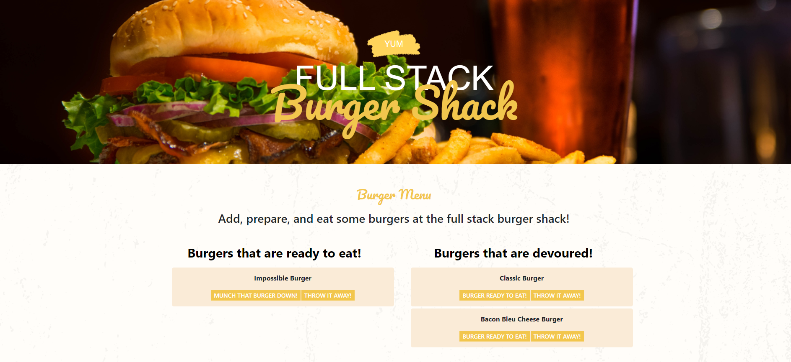

# full-stack-burger-shack
Node, Express and Handlebars application that uses the MVC pattern and Heroku to allow users to input their favorite burgers and DEVOUR them.

## Installation
Download the project contents and in the root folder run ```npm install``` to install dependancies 
Once install is complete run ```npm start``` to run the dev server

If you want to just view and use the application visit the deployed app at https://fullstack-burger-shack.herokuapp.com/

## Contributing
This project is intented to be a practice run at building an entirely full stack application. However if anyone would like to contribute it could use a test script and some more html routes for more dynamic functionality. 

## License 


